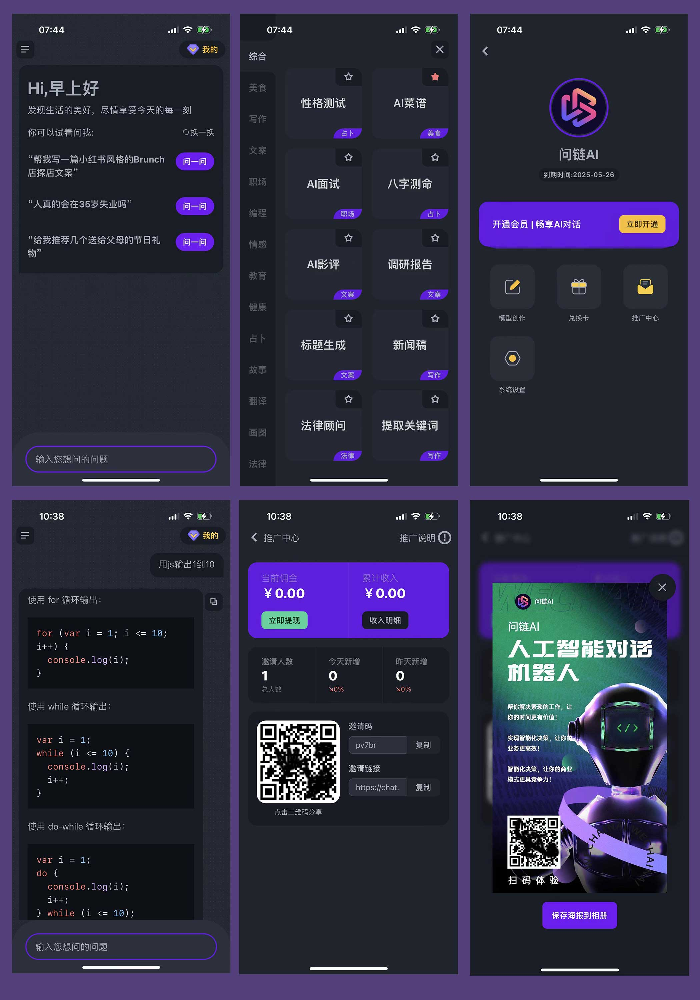

# gpt人工智能自然语言对话系统

> 当前市场最热的chat系统，支持H5、公众号、安卓app、苹果app，可以新增模型，设置会员价格，兑换卡、邀请用户注册、返利等功能，比较完善的一个系统，学习交流QQ: 9099021

## 界面截图

## 演示

当前有H5、公众号、安卓app、苹果app这4个客户端，由于苹果上架流程问题暂时无法给出演示地址

## 系统功能
- 微信公众号可以直接使用微信登陆
- 移动端可以使用微信登陆
- 苹果客户端可以使用微信、苹果登陆
- 支付支持原生微信支付宝、扫码、银联等支付，苹果客户端使用苹果支付
- 系统支持语法高亮
- 使用gpt3接口，可以对接任意其他gpt接口
- 邀请用户注册购买会员可返利，只支持一级分销
- 支持增加各种模型，后期会开放用户自定义模型和公开模型给所有用户使用
- 支持兑换卡兑换，兑换卡有两种形式，一种是日卡、一种是次卡
- app支持触感反馈，类似ios chatgpt的回复内容产生轻微震动效果，提高用户体验